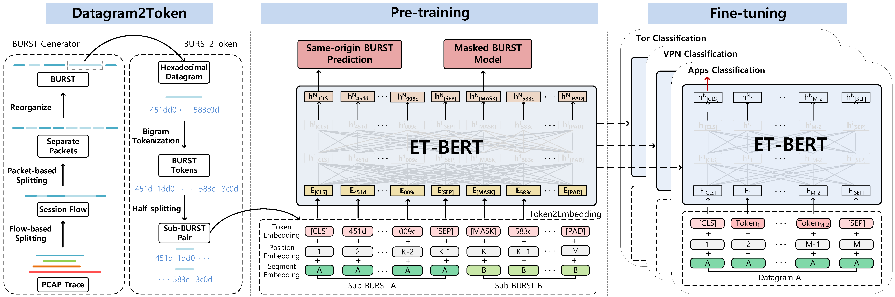

# ET-BERT: 使用预训练 Transformer 对加密流量进行上下文数据报表示的分类方法

<!-- 
[](https://codebeat.co/projects/github-com-linwhitehat-et-bert-main) 
 
[](https://arxiv.org/abs/2202.06335) 
-->

<p align="center">
  <a href='https://codebeat.co/projects/github-com-linwhitehat-et-bert-main'></a> 
  <a href=''></a> 
  <a href='https://arxiv.org/abs/2202.06335'>.svg'></a> 
  <a href='https://dl.acm.org/doi/10.1145/3485447.3512217' target='_blank'></a>
</p>

**注意：**
- ⭐ **如果您喜欢这个项目，请给我们一个<font color='orange'>星标</font>！** ⭐
- 如果您发现任何<font color='red'>错误</font>/<font color='red'>不当</font>/<font color='red'>过时</font>的内容，欢迎提出 issue 或 PR。

**这是 ET-BERT 的代码仓库，一个用于加密流量分类的网络流量分类模型。**

ET-BERT 是一种从加密流量中学习数据报上下文关系的方法，可以**直接应用于不同的加密流量场景并准确识别流量类别**。首先，ET-BERT 在大规模未标记流量中使用多层注意力机制来学习数据报间的上下文关系和流量间的传输关系。其次，通过对小规模标记加密流量进行微调，ET-BERT 可以应用于特定场景来识别流量类型。



本工作发表于 *[第31届万维网国际会议](https://www2022.thewebconf.org/)*:
> Xinjie Lin, Gang Xiong, Gaopeng Gou, Zhen Li, Junzheng Shi and Jing Yu. 2022. ET-BERT: A Contextualized Datagram Representation with Pre-training Transformers for Encrypted Traffic Classification. In Proceedings of The Web Conference (WWW) 2022, Lyon, France. Association for Computing Machinery.

注：本代码基于 [UER-py](https://github.com/dbiir/UER-py)。非常感谢作者们的工作。
<br/>

目录
=================
  * [环境要求](#环境要求)
  * [数据集](#数据集)
  * [使用 ET-BERT](#使用-et-bert)
  * [复现 ET-BERT](#复现-et-bert)
  * [引用](#引用)
  * [联系方式](#联系方式)
<br/>

## 环境要求
* Python >= 3.6
* CUDA: 11.4
* GPU: Tesla V100S
* torch >= 1.1
* six >= 1.12.0
* scapy == 2.4.4
* numpy == 1.19.2
* shutil, random, json, pickle, binascii, flowcontainer
* argparse
* packaging
* tshark
* [SplitCap](https://www.netresec.com/?page=SplitCap)
* [scikit-learn](https://scikit-learn.org/stable/)
* 对于混合精度训练，您需要 NVIDIA 的 apex
* 对于预训练模型转换（与 TensorFlow 相关），您需要 TensorFlow
* 对于使用 wordpiece 模型进行分词，您需要 [WordPiece](https://github.com/huggingface/tokenizers)
* 对于在序列标注下游任务中使用 CRF，您需要 [pytorch-crf](https://github.com/kmkurn/pytorch-crf)
<br/>

## 数据集
真实世界的 TLS 1.3 数据集收集自 2021 年 3 月至 7 月的中国科技网（CSTNET）。出于隐私考虑，我们只发布匿名数据（参见 [CSTNET-TLS 1.3](CSTNET-TLS%201.3/readme.md)）。

我们用于对比实验的其他数据集是公开可用的，详情请参见[论文](https://arxiv.org/abs/2202.06335)。如果您想使用自己的数据，请检查数据格式是否与 `datasets/cstnet-tls1.3/` 相同，并在 `data_process/` 中指定数据路径。

<br/>

## 使用 ET-BERT
您现在可以通过预训练[模型](https://drive.google.com/file/d/1r1yE34dU2W8zSqx1FkB8gCWri4DQWVtE/view?usp=sharing)直接使用 ET-BERT，或通过以下命令下载：
```
wget -O pretrained_model.bin https://drive.google.com/file/d/1r1yE34dU2W8zSqx1FkB8gCWri4DQWVtE/view?usp=sharing
```

获得预训练模型后，可以通过对标记网络流量进行包级别的微调，将 ET-BERT 应用于特定任务：
```
python3 fine-tuning/run_classifier.py --pretrained_model_path models/pre-trained_model.bin \
                                   --vocab_path models/encryptd_vocab.txt \
                                   --train_path datasets/cstnet-tls1.3/packet/train_dataset.tsv \
                                   --dev_path datasets/cstnet-tls1.3/packet/valid_dataset.tsv \
                                   --test_path datasets/cstnet-tls1.3/packet/test_dataset.tsv \
                                   --epochs_num 10 --batch_size 32 --embedding word_pos_seg \
                                   --encoder transformer --mask fully_visible \
                                   --seq_length 128 --learning_rate 2e-5
```

微调后的分类器模型默认保存路径为 `models/finetuned_model.bin`。然后您可以使用微调后的模型进行推理：
```
python3 inference/run_classifier_infer.py --load_model_path models/finetuned_model.bin \
                                          --vocab_path models/encryptd_vocab.txt \
                                          --test_path datasets/cstnet-tls1.3/packet/nolabel_test_dataset.tsv \
                                          --prediction_path datasets/cstnet-tls1.3/packet/prediction.tsv \
                                          --labels_num 120 \
                                          --embedding word_pos_seg --encoder transformer --mask fully_visible
```
<br/>

## 复现 ET-BERT
### 预处理
要复现在网络流量数据上预训练 ET-BERT 的必要步骤，请按以下步骤操作：
 1. 运行 `vocab_process/main.py` 生成加密流量语料库，或直接使用 `corpora/` 中生成的语料库。注意需要修改文件顶部的文件路径和一些配置。
 2. 运行 `main/preprocess.py` 预处理加密流量突发语料库。
    ```
       python3 preprocess.py --corpus_path corpora/encrypted_traffic_burst.txt \
                             --vocab_path models/encryptd_vocab.txt \
                             --dataset_path dataset.pt --processes_num 8 --target bert
    ```
 3. 如果有需要处理的 pcap 格式数据集，运行 `data_process/main.py` 生成下游任务的数据。此过程包括两个步骤。首先是通过在 `datasets/main.py:54` 设置 `splitcap=True` 来分割 pcap 文件，并保存为 `npy` 数据集。然后生成微调数据。如果您使用共享数据集，则需要在 `dataset_save_path` 下创建名为 `dataset` 的文件夹并将数据集复制到这里。

### 预训练
要复现在标记数据上微调 ET-BERT 的必要步骤，运行 `pretrain.py` 进行预训练。如果想在已预训练的模型基础上继续训练，可以增加参数 `--pretrained_model_path`。
```
   python3 pre-training/pretrain.py --dataset_path dataset.pt --vocab_path models/encryptd_vocab.txt \
                       --output_model_path models/pre-trained_model.bin \
                       --world_size 8 --gpu_ranks 0 1 2 3 4 5 6 7 \
                       --total_steps 500000 --save_checkpoint_steps 10000 --batch_size 32 \
                       --embedding word_pos_seg --encoder transformer --mask fully_visible --target bert
```

### 下游任务微调
要了解如何将 ET-BERT 用于加密流量分类任务的示例，请参阅[使用 ET-BERT](#使用-et-bert)部分和 `fine-tuning` 文件夹中的 `run_classifier.py` 脚本。

注意：您需要修改程序中的路径。
<br/>

## 引用
#### 如果您在学术工作中使用了 ET-BERT 的工作（如预训练模型），请引用发表在 WWW 2022 的[论文](https://dl.acm.org/doi/10.1145/3485447.3512217)：

```
@inproceedings{lin2022etbert,
  author    = {Xinjie Lin and
               Gang Xiong and
               Gaopeng Gou and
               Zhen Li and
               Junzheng Shi and
               Jing Yu},
  title     = {{ET-BERT:} {A} Contextualized Datagram Representation with Pre-training
               Transformers for Encrypted Traffic Classification},
  booktitle = {{WWW} '22: The {ACM} Web Conference 2022, Virtual Event, Lyon, France,
               April 25 - 29, 2022},
  pages     = {633--642},
  publisher = {{ACM}},
  year      = {2022}
}
```

<br/>

## 联系方式
如果您有任何问题，请在 Github 上提出 issue。欢迎讨论新的想法、技术和改进！
